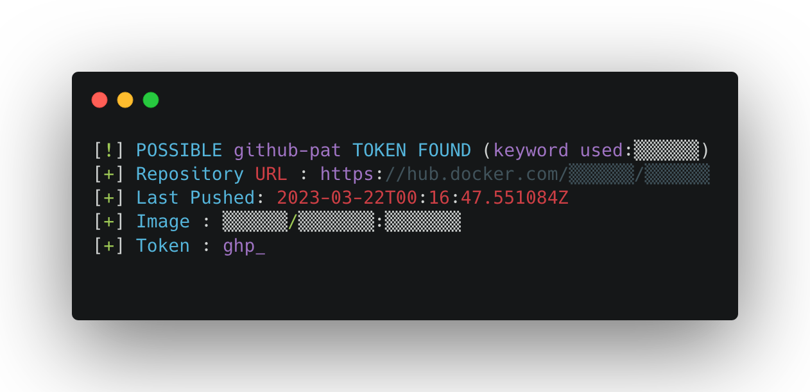

 
# About dockerhubGraber

**dockerhubGraber is a tool developed in Python3 to monitor dockerhub to search and find sensitive data for various online services. such as: Github, Amazon (AWS), Mailgun, Discord, Twitter, Heroku, Stripe, Twilio...**



## How it works ?


## Usage

``````````
usage: dockerhubGraber.py [-h] [-k KEYWORDSFILE] [-i IMAGESFILE] [-d] [-s] [-tg] [-v]

optional arguments:
  -h, --help            show this help message and exit
  -k KEYWORDSFILE, --keyword KEYWORDSFILE
                        Specify a keywords file (-k keywordsfile.txt)
  -i IMAGESFILE, --images IMAGESFILE
                        Create a file where all scanned images are stored
  -d, --discord         Enable discord notifications
  -s, --slack           Enable slack notifications
  -tg, --telegram       Enable telegram notifications
  -v, --verbose         Make the operation more talkative
``````````

## Dependencies

dockerhubGraber needs some dependencies, to install them on your environment:

``pip3 install -r requirements.txt``

## Configuration

Before your start **dockerhubGraber** you need to modify the configuration file ``config.py`` :

## Wordlists & Resources

Some wordlists & regex have been created by us and some others are inspired from other repos/researchers :

* https://gist.github.com/nullenc0de/fa23444ed574e7e978507178b50e1057
* https://github.com/streaak/keyhacks
* https://mathiasbynens.be/demo/url-regex

## TODO

- [X] Manage rate limit

# Disclaimer

This project is made for educational and ethical testing purposes only. Usage of this tool for attacking targets without prior mutual consent is illegal. Developers assume no liability and are not responsible for any misuse or damage caused by this tool.
